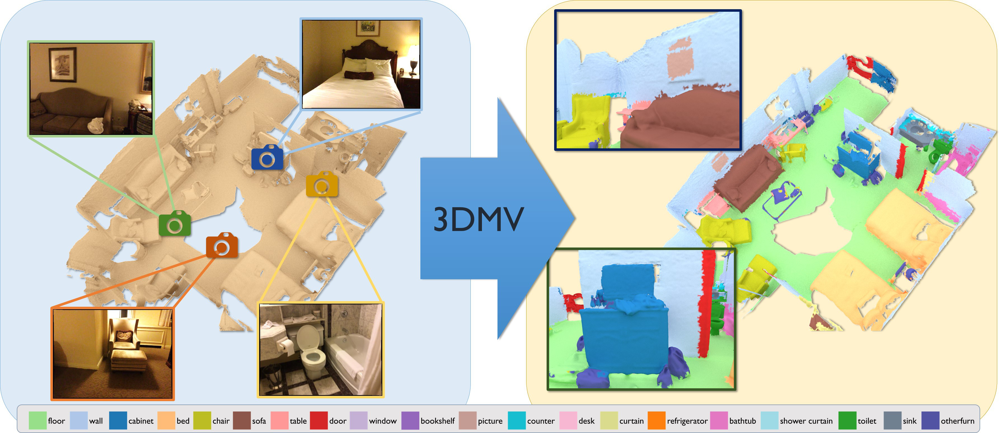

# 3DMV

3DMV jointly combines RGB color and geometric information to perform 3D semantic segmentation of RGB-D scans. This work is based on ECCV'18 paper, [
3DMV: Joint 3D-Multi-View Prediction for 3D Semantic Scene Segmentation](https://arxiv.org/pdf/1803.10409.pdf).

As the project from Machine Learning for 3d Geometry taught by Prof.Dai, we have done some modifications based on 3DMV. Our group members are: Qiancheng Hu, Dengyuan Hua, Qian Long, and Run Yuan.

[](https://arxiv.org/abs/1803.10409)

## modifications
* Use Spconv as 3D backbone and global scene for training instead of
chunks
* Use SegFormer as image backbone instead of 2D ConvNet
* Use ScanNet++ dataset instead of ScanNet dataset

## Code
### Installation:  
Training and testing code is implemented in PyTorch. We provide a conda environment file for setting up the environment.  
```
conda env create -f environment.yml
```

### Data Preparation:
Download the ScanNet++ dataset from the [official website](https://kaldir.vc.in.tum.de/scannetpp/documentation).
Preprocess the data by running the following command:
```
python -m prepare2d.rasterize_render prepare2d/rasterize_render.yml
```

### Training:
To train the model, run the following command:
```
python -m trainer config.yml
```